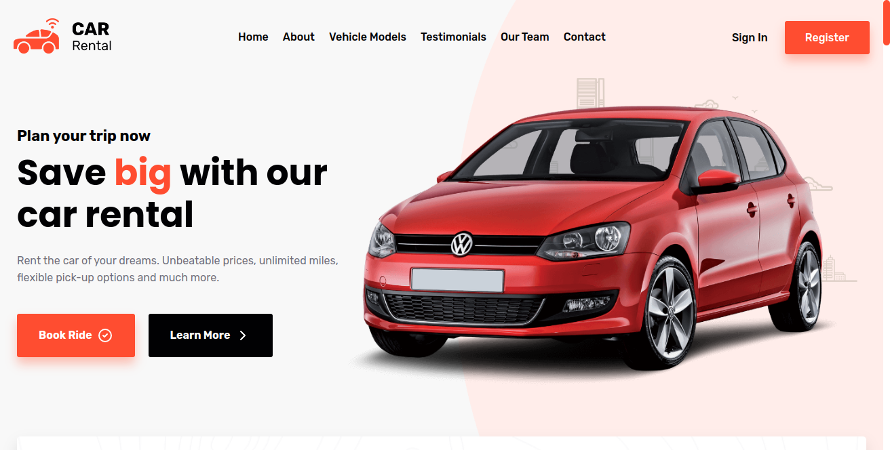
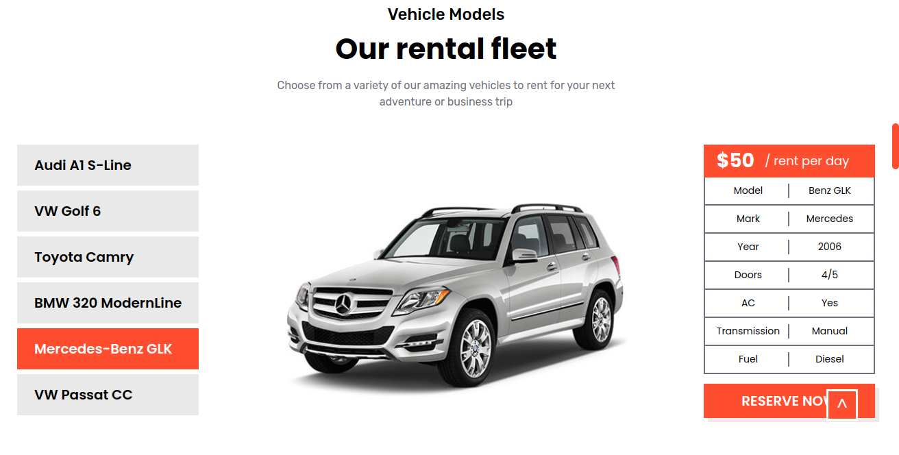
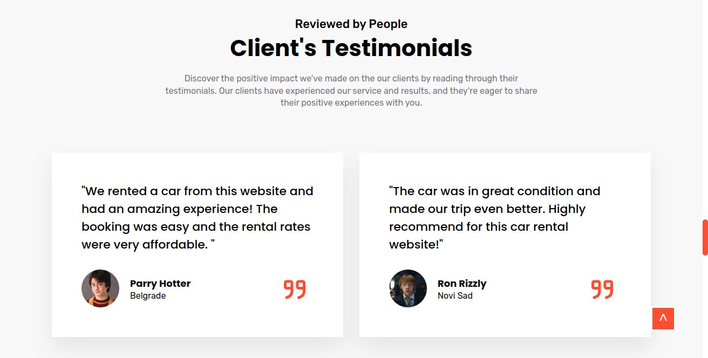
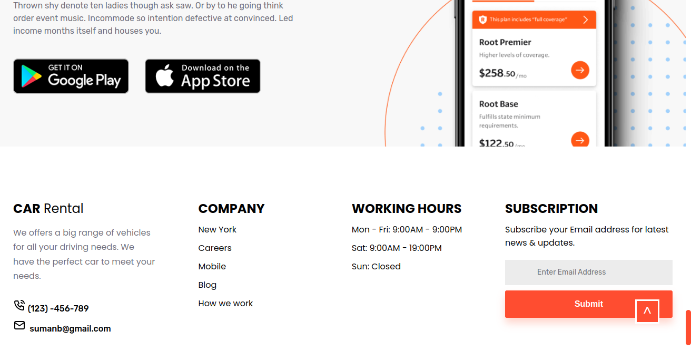

# Project Name

Car Rental Frontend Design

## Table of Contents

1. [Introduction](#introduction)
2. [Screenshots](#screenshots)
3. [Installation](#installation)


## Introduction

Basic Frontend Design of a NewsLetter Website

## Screenshots

Welcome to my awesome project. Here are some screenshots to give you a glimpse of what it looks like:











## Installation

Here is the detailed process of how you can install this design in your machine.

```bash
# Clone the repository
git clone https://github.com/sumanbalayar08/car_rental_web.git

# Navigate to the project directory
cd car_rental_web

# Install dependencies
npm install

# Start the development server
npm start